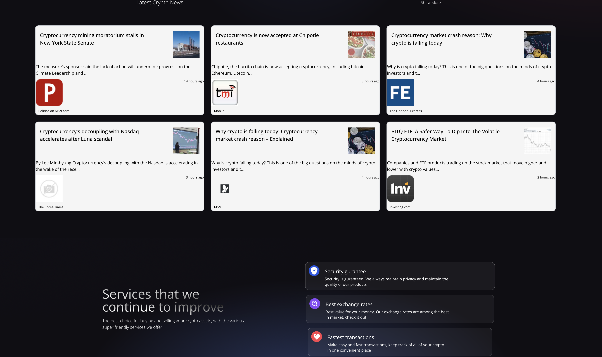
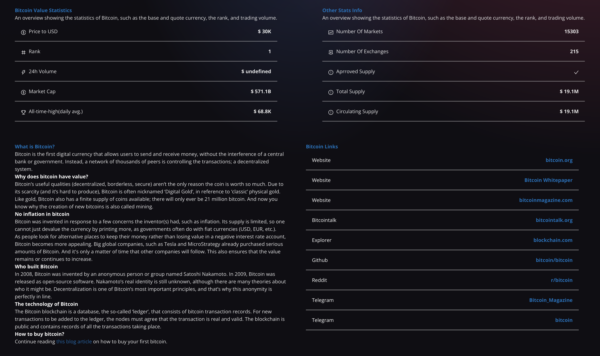
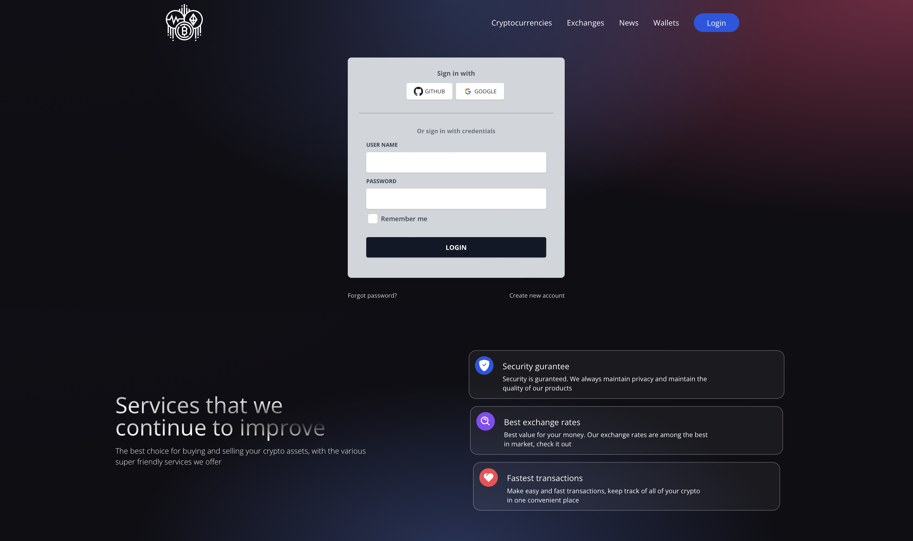
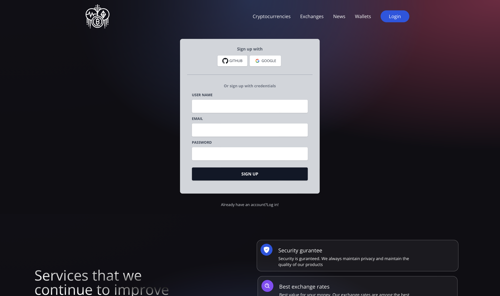
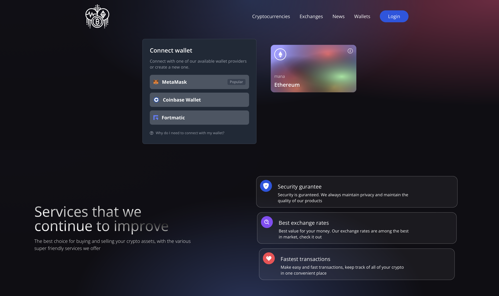

#C-Crypto Web Application

##Start the app
Note this command starts the frontend. Server Side (Backend) is deployed and runing on AWS ECS. 

```bash
cd /frontend
```
```bash
npm run dev
```
The app will start on localhost:3000


# Application Overview:

### Home Page



### Currency Page



### Login Page


### SignUp Page


### Wallet Page


# Spring Boot, Spring Security, PostgreSQL: JWT Authentication & Authorization

## User Registration, User Login and Authorization process.
The diagram shows flow of how we implement User Registration, User Login and Authorization process.


## Refresh Token


